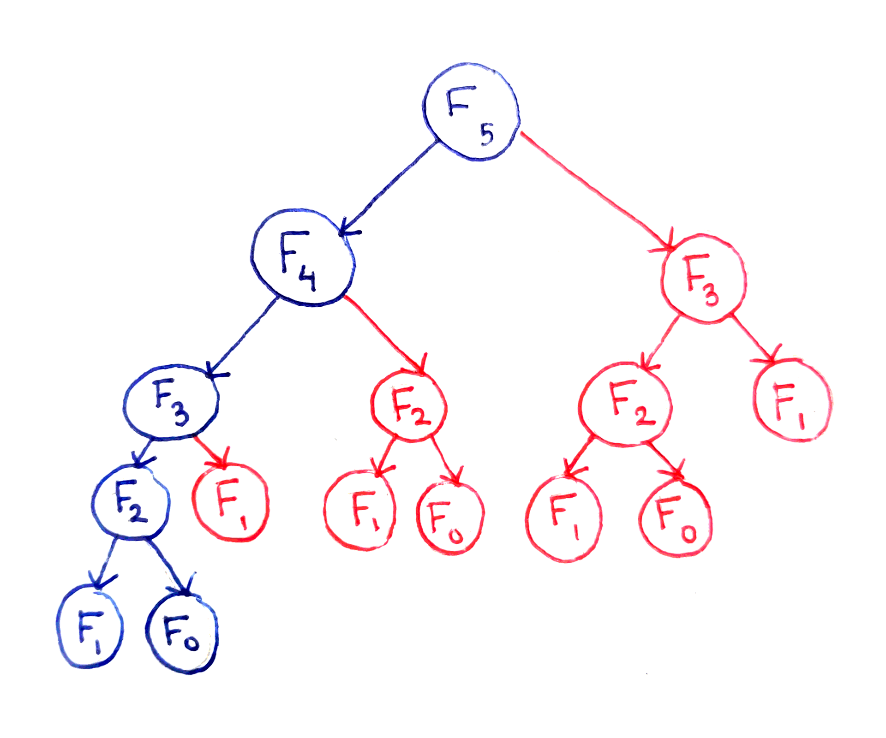

<h2 class="text-center text-decoration-underline font-weight-bold">
    Introducerea in programarea dinamica
</h2>

    Este o metoda de elaborare a algoritmilor, in care problema data este
    descompusa in subprobleme, iar solutia optima a problemei depinde de 
    solutiile optime ale subproblemelor sale. Subproblemele problemei date
    nu sunt independente, ci se suprapun, astfel o abordare prin metoda
    "Divide et impera" ar fi neeficienta, intrucat s-ar ajunge de repetate
    ori la rezolvarea a aceleiasi subprobleme.

 

    Rezolvarea unei probleme prin programare dinamica 
    presupune urmatorii pasi:

<ul>
    <li>
Se indentifica subproblemele problemei date
</li>
    <li>
        

            Se alege o structura de date pentru a se retine
            solutiile subproblemelor (ex: un tablou bidimensional)
        

    </li>
    <li>
        

            Se determina solutia optima, prin rezolvarea recurenta a
            subproblemelor in ordinea crescatoare a dimensiunii lor.
        

    </li>
</ul>
 

    Exemple de probleme care se pot rezolva prin programarea dinamica:

Sirul lui fibonacci provine din urmatoare relatie de recurenta:

Imaginea urmatorului arbore arata modul in care se afla al 5-lea din sir:

    Dupa cum se poate observa, pentru aflarea celui de al 5-lea termen din sir
    a fost nevoie sa fie calculat de doua ori al treilea termen din sir. Astfel,
    pentru optimizarea rezolvarii se poate salva solutia celui de al 3-lea termen
    din sir intr-o structura de date (ex: hashmap) si sa fie refolosita, fara a
    fi nevoie ca aceasta subproblema sa fie rezolvata din nou.

